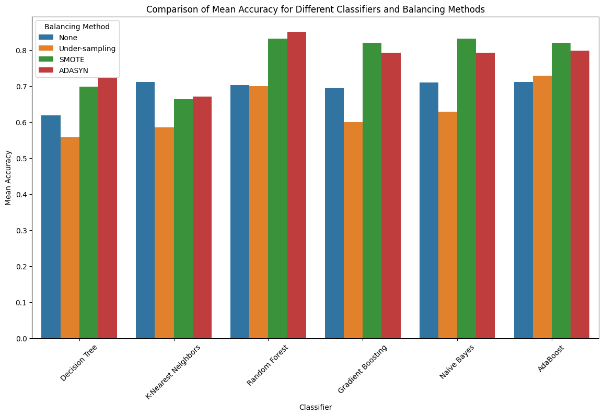

# ⚕️ HCC Survival Predictor: Machine Learning for Clinical Prognosis

[](https://www.python.org/)
[](https://scikit-learn.org/)
[](https://pandas.pydata.org/)
[](https://imbalanced-learn.org/)

## 🎯 Project Overview
This project addresses the challenge of predicting patient survival (1-year horizon) after a diagnosis of **Hepatocellular Carcinoma (HCC)**.

Using clinical data from the **Hospital and University Centre of Coimbra**, I developed a supervised learning pipeline to handle real-world medical data issues—specifically high sparsity (missing values) and severe class imbalance. The goal was to determine which combination of **imputation + balancing + classification** yields the most reliable prognosis tool.

---

## 📈 Executive Performance Summary
The project conducted an exhaustive comparative study of **6 classifiers** across **4 data balancing strategies** (None, Under-sampling, SMOTE, ADASYN).

**Key Finding:** Standard algorithms failed to detect the minority class ("Dies") effectively. However, applying **SMOTE** drastically improved performance, with **Naive Bayes** and **Random Forest** emerging as the top performers.

| Architecture | Balancing Technique | Mean Accuracy | Mean Precision | Improvement |
| :--- | :--- | :--- | :--- | :--- |
| **Naive Bayes** | **SMOTE** | **83.76%** | **0.868** | **🏆 Best Accuracy** |
| Random Forest | ADASYN | 83.26% | 0.875 | 🥈 Best Precision |
| Random Forest | SMOTE | 82.57% | 0.859 | High Stability |
| Gradient Boosting | SMOTE | 81.45% | 0.858 | Strong Baseline |
| *Decision Tree* | *Under-sampling* | *51.42%* | *0.480* | *Poor Performance* |

**Key Takeaway:** The combination of **SMOTE** with probability-based models (Naive Bayes) or ensembles (Random Forest) provided the best balance between precision and overall accuracy, significantly outperforming under-sampling methods.

---

## 🔬 Technical Deep Dive

### 1. Data Integrity & Preprocessing
Real-world clinical data often contains gaps. I implemented a robust cleaning strategy:
* **Hybrid Imputation:**
    * Categorical features were filled using the **Mode**.
    * Complex numerical missing data was reconstructed using **KNN Imputation**, leveraging patient similarity to infer missing metrics.
* **Feature Engineering:** Manual encoding of ordinal clinical features and creation of dummy variables to prevent ordinal bias.

### 2. Handling Class Imbalance
To address the imbalance between "Lives" and "Dies" cases, I tested three distinct strategies against the baseline:
* **Under-sampling:** Randomly removing majority class examples (Resulted in data loss and poor performance).
* **SMOTE:** Generating synthetic interpolation of minority class samples to create a balanced decision boundary.
* **ADASYN:** Adaptive synthesis that focuses on generating data next to original samples that are wrongly classified.

### 3. Model Architectures
I trained and evaluated the following classifiers:
* **Ensemble Methods:** Random Forest, Gradient Boosting, AdaBoost.
* **Probabilistic:** Naive Bayes (Gaussian).
* **Distance/Linear:** K-Nearest Neighbors (KNN), Decision Trees.

---

## 📊 Visual Insights & Final Analysis

| Survival Prediction Analysis | Analysis |
| :---: | :--- |
|  | **Key Findings:** The visual analysis confirms that while simpler models struggle with the "Dies" class (minority), the ensemble methods boosted by SMOTE manage to separate the decision boundaries more effectively. This reduces False Negatives, which is critical in a medical setting where missing a high-risk patient is costly. |

---

## 🛠️ Installation & Usage

### 1. Clone & Setup
```bash
git clone [https://github.com/Pedrooamaroo/HCCSurvivalPredictor.git](https://github.com/Pedrooamaroo/HCCSurvivalPredictor.git)
cd HCCSurvivalPredictor
pip install pandas numpy seaborn scikit-learn imbalanced-learn fancyimpute ydata-profiling
